# Project-1

This is a business site for the tattoo studio Almen-Ink, on it you can browse the studios art, book consultation for an idea, read about the artists and learn how to nurse a healing tattoo, it also contains links to a webshop for other arts.

## Content
---

* [Technologies used](https://github.com/Enquil/CodeInstitute-Project-1#technologies-used)
* [Pages and Features](https://github.com/Enquil/CodeInstitute-Project-1#pages-and-features)
* [User Experience](https://github.com/Enquil/CodeInstitute-Project-1#user-experience)
* [Accessibility](https://github.com/Enquil/CodeInstitute-Project-1#accessibility)
* [Testing](https://github.com/Enquil/CodeInstitute-Project-1#testing)
* [Deployment](https://github.com/Enquil/CodeInstitute-Project-1#deployment)
* [Credits](https://github.com/Enquil/CodeInstitute-Project-1#credits)
* [Site Expansion](https://github.com/Enquil/CodeInstitute-Project-1#site-expansion)
* [Known Issues](https://github.com/Enquil/CodeInstitute-Project-1#known-issues)

## Technologies used
---

* HTML
* CSS

## Pages and Features
---

### Welcome/About

This page serves 2 purposes. 
It is the main welcome page as well as an introduction to the owner and artists working here.
It contains a short bio, as well as links to other work from the artists.

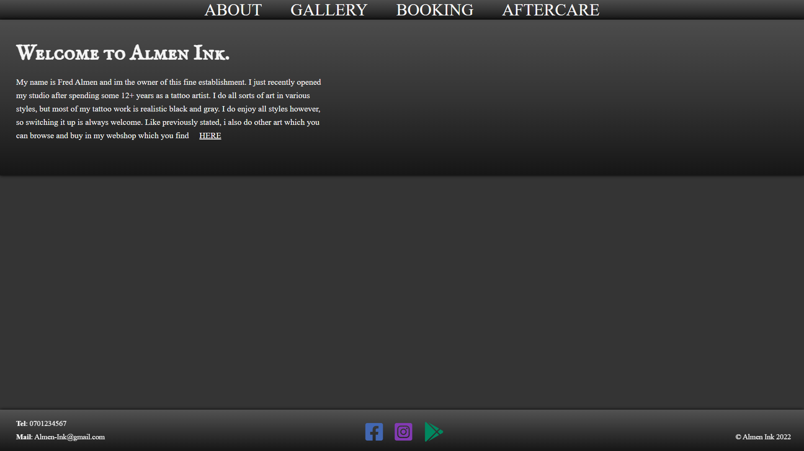

### Gallery

Contains image galleries with tattoo art done at the studio, there will be image descriptions implemented with the JS gallery, but it looked so lackluster to do it straight HTML/CSS.

![Screenshot of the Gallery Page]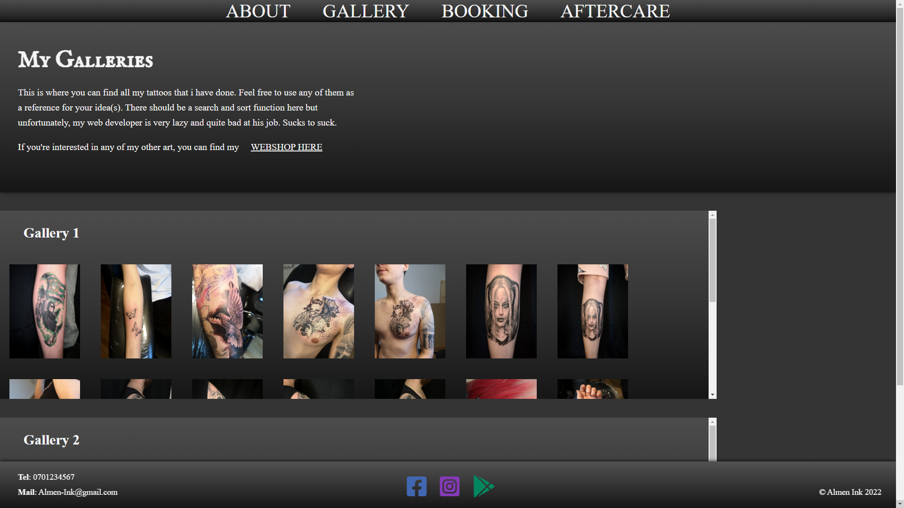
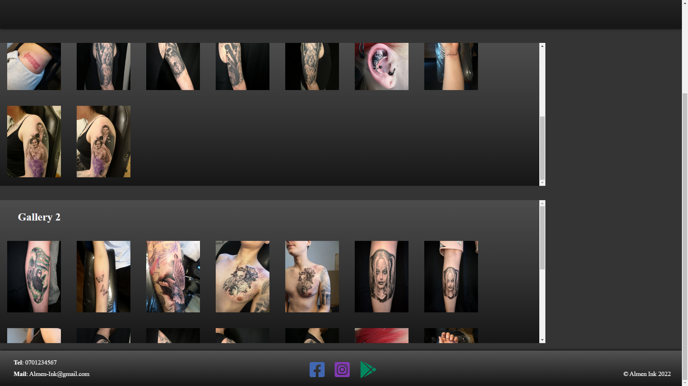

### Booking

This page lets you book a consultation with the studio via JavaScript form and attach images or other files that might be relevant, it also contains info about booking and fees but the client has not decided on one yet.

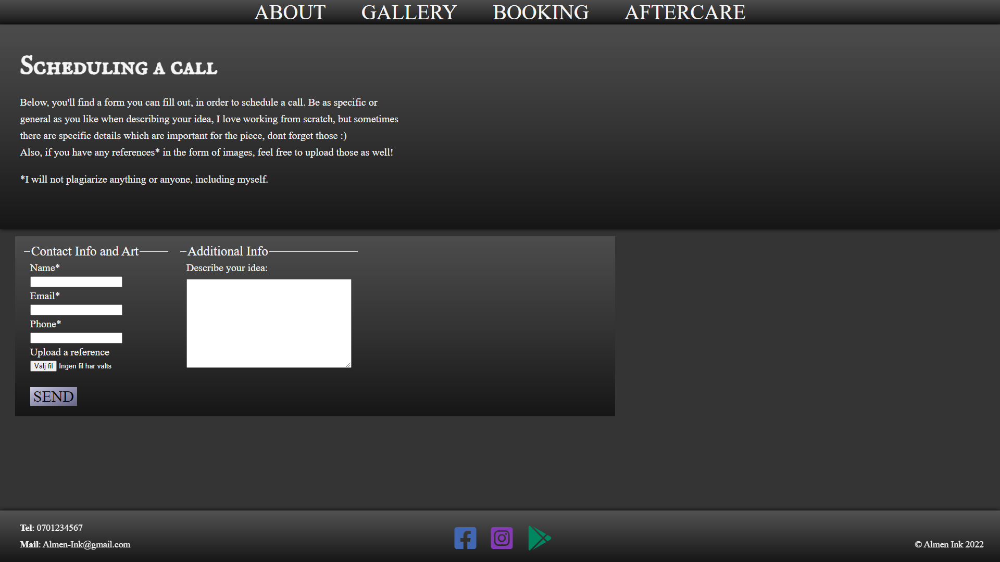

### Aftercare

Instructions on how to nurse a tattoo, contains a downloadable .pdf that provides full coverage from day 1 to fully healed.  
Also contains a "first 2 weeks"-guide with some general tips that are extra crucial during initial stages of healing.

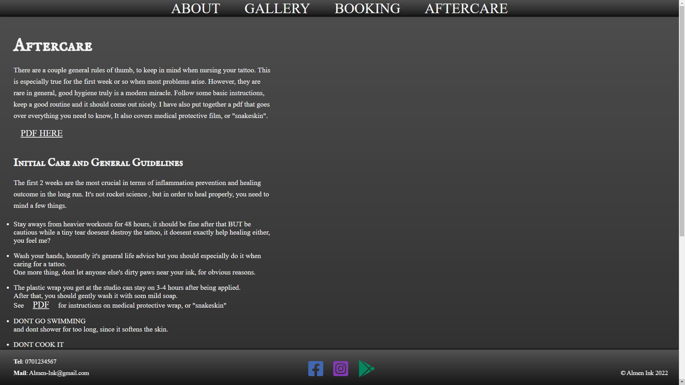
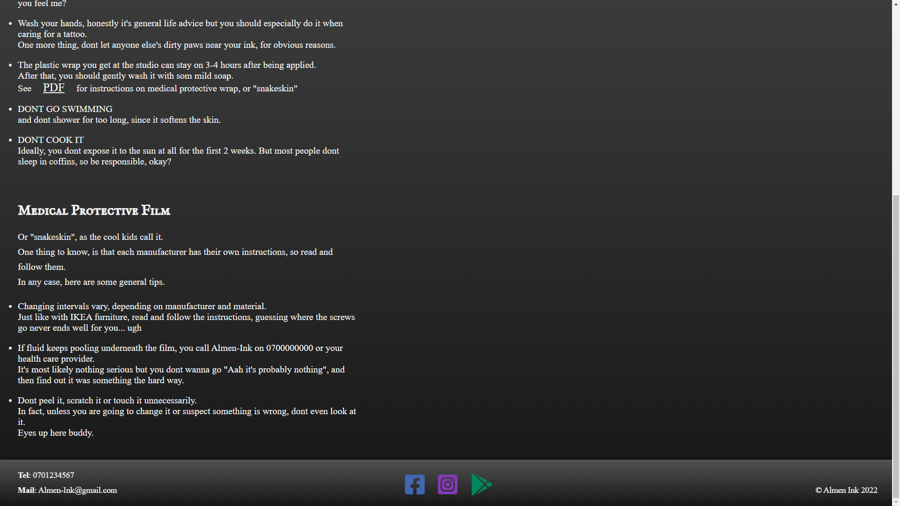

### Navigation Bar

Same on every page, trimmed it down to 4 buttons in the end, About, Gallery, Booking and Aftercare.

### Footer

Fixed position, contains phone-nr and email to the left, social media in the middle and a copyright on the right.

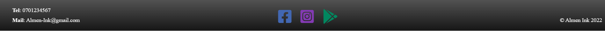

### Missing Content

* Link to webshop does not work, since it doesent exist yet.
* Right side images and some Javascript in the whitespace is missing, will be incorporated simultaneously, credits will also be added then.
* MAP will be added once the correct adress is updated on google.

## User Experience and Design
---

* Overarching design and Colourscheme

  * Tried out a few designs/color schemes and because of what the subject/client is, this felt most appropriate, left side is text, right is related art/images, want to end it up having a "booky" feel to it.
  * Social Media was colored to make it stand out a bit against the rest of the page, no idea if it actually will make people click it more but i figured it wont hurt.
  * Links are offset in some way, i chose it to "highlight" them a bit.

* Colours

  * Black/gray backgrounds with white text, had some worries about visibility when using opacity and a textured background, but feedback has been good thus far.
  * Background is not black and grey scale, looking into more fun options.
  * Text is whitesmoke, rgb(245, 245, 245).
  * Nav, page-welcome and footer is linear-gradient top -> right rgba(82, 82, 82, 0.8), rgba(52, 52, 52, 0.9), rgba(22, 22, 22).
  * Submit button on form is linear gradient top-left -> bottom right RGB(202, 202, 222), rgb(162, 162, 192), rgb(132, 132, 162), rgb(102, 102, 132).

* Fonts

  * Most headings except for the gallery names are IM Fell English SC from google fonts, chose link over import because im not sure about pros/cons yet.
  * Everything else is Times New Roman

* Icons are using FontAwesome for social media and homebutton icons, it did the job.

  * Facebook https://fontawesome.com/icons/facebook-square?s=brands
  * Instagram: https://fontawesome.com/icons/instagram-square?s=brands
  * Google: https://fontawesome.com/icons/google-play?s=brands
  * Homebutton: https://fontawesome.com/icons/house-chimney?s=solid

* JavaScript related design
  * None implemented yet, most JS will be infrastructure only but some animation will probably be implemented at a later date.

## Accessibility
---

Tried using semantic markup throughout the page, think it went alright but some of the pages are probably still a bit ambiguous.

* Aria labels
  * Solved

## Testing
---
 ### I used lighthouse test at https://web.dev/measure/ and came up with the following scores and issues, just enter whatever URL you want to test 

  #### Index page result and issues
    * Google fonts and fontawesome script is "render-blocking", im going to see if a customized icon can solve this
  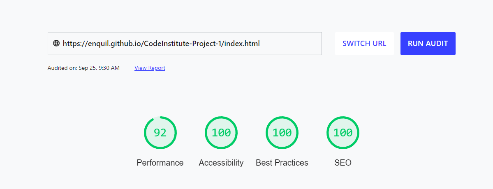

  #### Gallery page results and issues
    * Img sizes are not rendered at their natural
    * Using <h3> on gallery heading, this is wrong since there is no h2 present.
    * Google fonts and fontawesome script is "render-blocking" 
  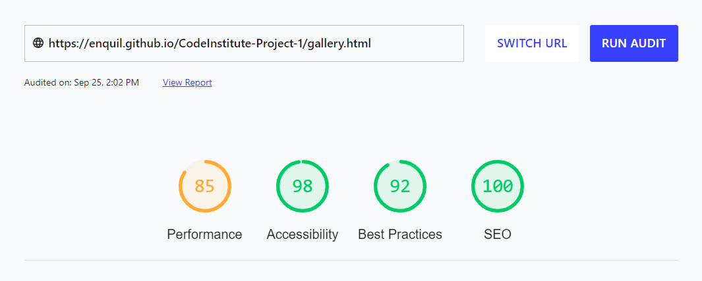 

  #### Booking page results and issues
    * Google fonts and fontawesome script is "render-blocking"
  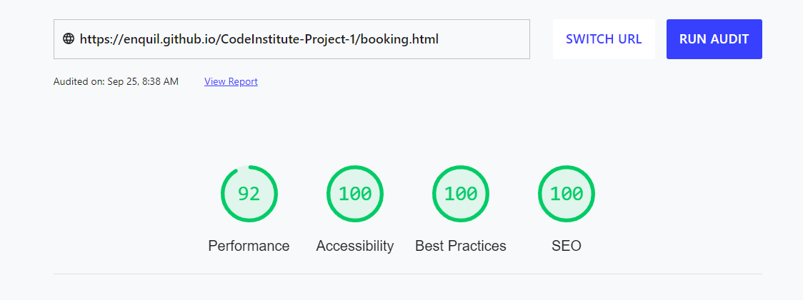

  ####
    * Google fonts and fontawesome script is "render-blocking"
  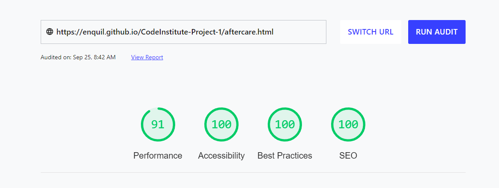

 * <a href = "https://jigsaw.w3.org/css-validator/validator?uri=https%3A%2F%2Fenquil.github.io%2FCodeInstitute-Project-1%2F&profile=css3svg&usermedium=all&warning=1&vextwarning=&lang=sv">Jigsaw Validator results</a>
 * <a href = "https://validator.w3.org/nu/?doc=https%3A%2F%2Fenquil.github.io%2FCodeInstitute-Project-1%2F">W3C validator results</a> (same errors as lighthouse, cant figure it out).

## Deployment
---

### Deploying your Page on GitHub

* In your github repository, click the "settings" button in the navbar above your files, it looks like a cogwheel.
* In the left-hand menu, select "pages".
* Under source, select which branch the webpage is being built from (main for me, and i think it's defautlt).
* The page will automatically refresh and you should see a green field with a link you your new page.

## Site Expansion Ideas and Future Improvements
---
* Javascript gallery will be implemented with the rest of the images and a search/sort function.
* Not a site expansion per say, but webshop will be added.
* Form is getting connected to a mail in order to recieve consultation bookings smoothly.
* Some JavaScript animation will be implemented.
* Images on the right side "margin".
* Some system to handle data from competitions etc. that the studio holds, in the end, some form of API like system might be needed/warranted.

## Known Issues
---
* ((SOLVED)) "Wrong" Aria-label on social media/homebutton icons, will be fixed as soon as i know why theyre actually considered wrong, letting them stay now because i will get an error either way.
* ((SOLVED)) I noticed a small gap on the right side of the nav on some screen sizes, not sure what the problem actually is, i tried removing the margin and change position but it didnt actually do anything useful so will investigate further.
* ((SOLVED)) images are not rendered properly.
* Link to webshop and booking form is broken, at the moment, this is solved with a modal containing contact information.

